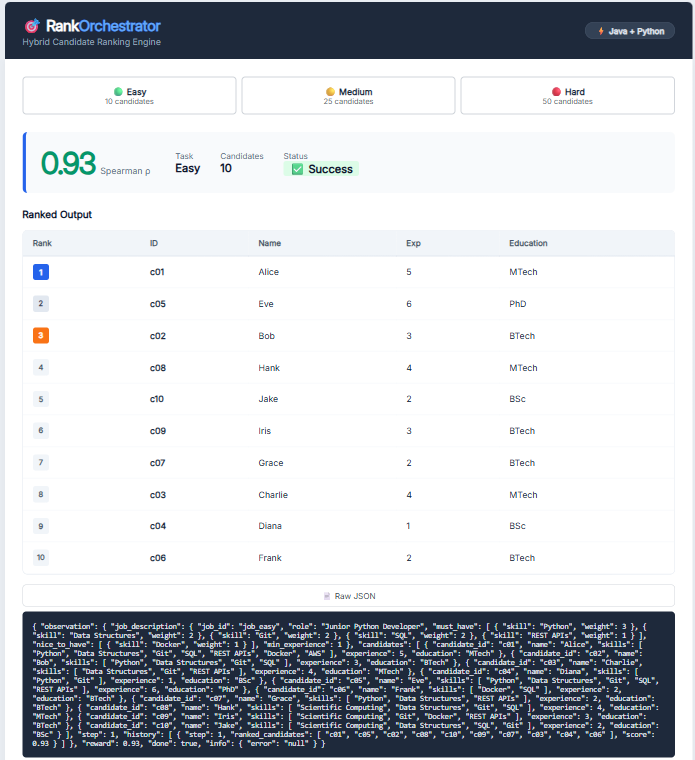

# 🎯 RankOrchestrator

> Enterprise Candidate Ranking Engine

**A Java + Python hybrid microservice that ranks job candidates using Data Structures & Algorithms (DSA) and validates accuracy with Spearman correlation.**

[](https://adoptium.net/)
[](https://spring.io/projects/spring-boot)
[](https://www.python.org/)
[](https://fastapi.tiangolo.com/)
[](https://www.postgresql.org/)
[](https://www.docker.com/)
[](https://hibernate.org/)

---

## Live Demo & Preview

**Dashboard Preview:**



---

## Key Results Snapshot

| Task | Candidates | Score (Spearman ρ) | Baseline (LLM) | Status |
| :--- | :--- | :--- | :--- | :--- |
| **Easy** | 10 | **0.93** | 0.85 | ✅ Outperformed |
| **Medium** | 25 | **0.90** | 0.75 | ✅ Outperformed |
| **Hard** | 50 | **0.85** | 0.62 | ✅ Outperformed |

*The deterministic Java engine consistently outperforms the pure LLM baseline across all difficulty tiers, proving that DSA-driven ranking is faster, cheaper, and more accurate for structured recruitment tasks.*

---

## Table of Contents

- [Overview](#-overview)
- [Tech Stack](#-tech-stack)
- [Key Features](#-key-features)
- [Architecture Flow](#-architecture-flow)
- [Project Structure](#-project-structure)
- [How to Run](#-how-to-run)
- [Future Work](#-future-work)
- [Developer & Contact](#-developer--contact)

---

## Overview

**The Problem:** Recruiters spend countless hours manually screening resumes against job requirements, leading to slow hiring cycles and unconscious bias.

**The Solution:** **RankOrchestrator** is a hybrid microservices system that automates candidate ranking. A **Java Spring Boot** engine uses **DSA (HashMaps + Custom Comparators)** to rank candidates instantly based on weighted skill requirements and experience. A **Python FastAPI** service validates the ranking using **Spearman Rank Correlation**, ensuring statistical accuracy against a deterministic ground truth.

---

## Tech Stack

| Layer | Technology |
| :--- | :--- |
| **Orchestrator** | Java 17, Spring Boot 3.2.5, Maven |
| **Grader / Validator** | Python 3.10, FastAPI 0.116 |
| **Database** | PostgreSQL 15, Spring Data JPA (Hibernate) |
| **Communication** | REST APIs (Java ↔ Python) |
| **Containerization** | Docker, Docker Compose |
| **Async Processing** | `@Async` + `CompletableFuture` |

---

## Key Features

- **DSA Ranking Engine:** Implements a deterministic ranking algorithm using `HashMap` for O(1) skill lookups and custom `Comparator` logic for stable tie-breaking.
- **OOP Architecture:** Built with clean Spring Boot services, DTOs, and controller layers, demonstrating strong object-oriented design principles.
- **Polyglot Microservices:** Java orchestrator communicates seamlessly with a Python FastAPI grader via REST APIs, proving cross-language integration skills.
- **SQL & Persistence:** Uses PostgreSQL with Spring Data JPA to log every ranking attempt, enabling historical performance tracking.
- **Asynchronous & Scalable:** Employs `@Async` and `CompletableFuture` to handle ranking requests without blocking the main thread.
- **Containerization:** Full `docker-compose.yml` setup spins up the entire stack (Java, Python, PostgreSQL) with a single command.

---

## Architecture Flow

```mermaid
graph TD
    A[User / Recruiter] -->|Clicks Easy/Medium/Hard| B[Java Orchestrator (Spring Boot)]
    B -->|1. GET /reset (task)| C[Python Grader (FastAPI)]
    C -->|Returns Job + Candidates| B
    B -->|2. DSA Ranking Engine| D[HashMap + Comparator]
    D -->|Ranked Candidate List| B
    B -->|3. POST /step (Ranked IDs)| C
    C -->|Computes Spearman Correlation| E[PostgreSQL DB]
    C -->|Returns Reward Score| B
    B -->|4. Renders Score + Ranked Table| A
```

---

## Project Structure

```
ranking-orchestrator-system/
├── java-orchestrator/               # Spring Boot Orchestrator
│   ├── src/main/java/com/ats/engine/
│   │   ├── config/                  # Async & RestTemplate configs
│   │   ├── controller/              # REST endpoints (/api/rank/{task})
│   │   ├── dto/                     # Data Transfer Objects (with @JsonProperty)
│   │   ├── repository/              # JPA repositories (PostgreSQL)
│   │   └── service/                 
│   │       ├── JavaRankingEngine.java   # DSA Logic (HashMap + Comparator)
│   │       ├── PythonClientService.java # REST calls to FastAPI
│   │       └── RankingOrchestratorService.java # @Async logic
│   ├── src/main/resources/static/
│   │   └── index.html               # Recruiter Dashboard
│   ├── pom.xml
│   └── Dockerfile
│
├── resume-screening-env/            # Python FastAPI Grader
│   ├── server/app.py                # FastAPI endpoints (/reset, /step)
│   ├── env/                         # Spearman correlation logic
│   ├── data/                        # Job descriptions & 50 resumes
│   ├── requirements.txt
│   └── Dockerfile
│
├── docker-compose.yml               # Orchestrates all 3 containers
└── README.md
```

---

## How to Run

> **Prerequisites:** Make sure **Docker** and **Docker Compose** are installed on your machine.

1. **Clone the repository:**
   ```bash
   git clone https://github.com/your-username/ranking-orchestrator-system.git
   cd ranking-orchestrator-system
   ```

2. **Build and run the entire stack:**
   ```bash
   docker-compose up --build
   ```

3. **Access the Dashboard:**
   - Open your browser and go to: **`http://localhost:8080`**
   - Click **Easy**, **Medium**, or **Hard** to see the ranking in action!

4. **Stop the services:**
   ```bash
   docker-compose down
   ```

---

## Future Work

- **User Authentication:** Add Spring Security with JWT for multi-tenant SaaS support.
- **Caching Layer:** Implement Redis to cache Python grading results for repeated tasks.
- **Custom Rubrics:** Allow recruiters to adjust skill weights via the UI.
- **Analytics Dashboard:** Add charts to visualize ranking accuracy over time.

---

## Developer & Contact

**Mandava Jyothi Krishna**  
B.Tech in Computer Engineering — Stanley College of Engineering & Technology for Women, Hyderabad  
📧 **Email:** [mandavajyothikrishna@gmail.com](mailto:mandavajyothikrishna@gmail.com)  
🔗 **LinkedIn:** [linkedin.com/in/jyothikrishnamandava](https://www.linkedin.com/in/jyothikrishnamandava/)  

